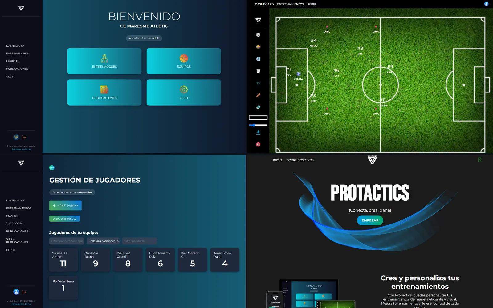

# ProTactics

Management platform for football clubs:
- **Clubs** manage their coaches, teams and players.
- **Coaches** plan training sessions, draw them on an interactive tactics board and share them with the rest of the club.

**[Try the live demo](https://alanteixido.github.io/ProTactics/)**. On the login screen, enter as the demo club or as a demo coach with one click. The demo runs entirely in your browser (details below), so feel free to create, edit and delete things.

<a href="https://alanteixido.github.io/ProTactics/"></a>

## Features

- **Two roles.** A club manages its coaches, teams by category (Aleví, Infantil, Cadet…) and the posts its coaches share. A coach manages players and training sessions, and publishes sessions to the club.
- **Players.** Each player has a name, position, shirt number and birth date. Lists can be filtered by name, position or number, and players can be imported in bulk from a CSV file.
- **Training sessions.** Each session has a category (ABP, physical, tactical, finishing, possession), a pitch, duration, repetitions, rest and the players involved. Sessions can be searched, sorted and summarised with progress rings.
- **Tactics board.**
  - Drag players, the ball and cones onto the pitch, and draw freehand with the pencil and eraser.
  - Undo, clear the board, or export it as a PNG.
  - The layout is saved with its training session.
- **Club feed.** Coaches publish their sessions to the rest of the club, where others can see and like them.

## Demo mode

When the app is built without `VITE_API_URL`, `src/demo/` replaces Axios's network adapter with an in-browser version of the API. It answers every call from a seeded club stored in `localStorage`:
- **Seed data:** "CE Maresme Atlètic", with 3 coaches, 3 teams, 18 players, 6 sessions and 5 posts;
- **API behaviour:** the status codes, error messages and per-club scoping of the [real API](https://github.com/AlanTeixido/ProTactics-API), with a little simulated latency;
- **Reset:** "Restablecer demo" restores the original data.

With `VITE_API_URL` set, the same build talks to the real [ProTactics API](https://github.com/AlanTeixido/ProTactics-API) (Node.js, Express, PostgreSQL, JWT).

## Stack

Vue 3 (`<script setup>`), Vue Router, Axios, Vite, Chart.js and html2canvas, which exports the board. On every push to `main`, [GitHub Actions](.github/workflows/pages.yml) builds the app and publishes it to GitHub Pages.

## Run it locally

```bash
cd protactics
npm install
npm run dev                                          # demo mode, no backend needed
VITE_API_URL=http://localhost:3000 npm run dev       # against a local ProTactics API
```

## Team

ProTactics was built as a three-person team project by Alex ([@mcalex468](https://github.com/mcalex468)), Adri ([@rodriguezAdri](https://github.com/rodriguezAdri)) and Alan ([@AlanTeixido](https://github.com/AlanTeixido)). The team worked in Scrum sprints; the daily notes are in [`dailyScrum/`](dailyScrum) and the first mockups in [`mockup/`](mockup).
